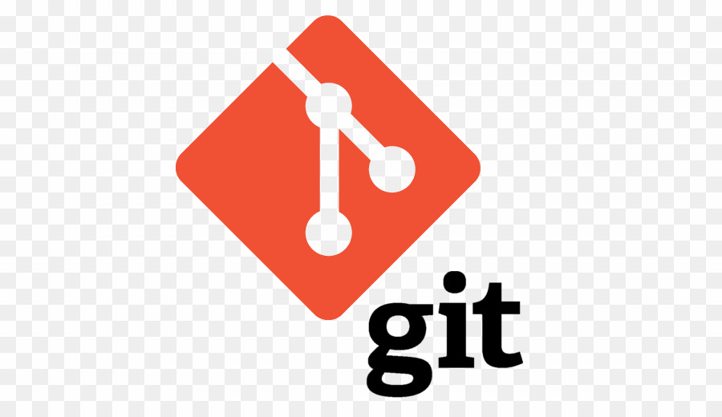

class: center, middle
# ¿Qué es Git?

---

# Git

- Git es un sistema de control de versiones creado por *Linus Torvalds*.
- Un sistema de control de versiones es una porción de software diseñada para tener seguimiento
de los cambios a lo largo del tiempo. 
- Git es un sistema de control de versiones *distribuido*, que significa que cada uno que trabaja con Git tiene una copia de la historia completa del proyecto. 

### Ventajas de usar Git
- La habilidad para deshacer cambios.
- Una historia completa de todos los cambios.
- Documentación de por que los cambios fueron hechos. 
- La tranquilidad de cambiar cualquier cosa. 
- Muchas lineas históricas. 
#### Si trabajamos en equipo
- La habilidad para resolver conflictos. 
- Creación de ramas para trabajar de manera independiente. 

---

# GitHub

- GitHub es un sitio web donde puedes subir una copia de tu repositorio de GitHub. Te permite colaborar más facilmente con otras personas en el proyecto. Lo hace proveyendo una ubicación centralizada para compartir el repositorio, una interfaz basada en la web, y caraceterísticas especiales como _fork, pull requests, issues, y wikis_.

### Ventajas de GitHub
- Colaborar en diferentes ramas de trabajo. 
- Re-ver el trabajo en progreso. 
- Ver el progreso del equipo. 

---

# Conceptos Clave
- __Commit__: cada vez que se guarda un cambio en cualquier archivo, se crea un commit. Cada vez
que se realiza un commit se agrega un mensaje describiendo el cambio realizado. 
- __Branch(rama)__: una serie de commits que se crean para agregar una nueva funcionalidad. 
- Master branch (rama master): cuando creamos un repositorio, es la rama creada por defecto. Es la rama en donde terminarán todos los cambios realizados cuando pasen a producción (etapa final).
- __Topic master(rama propia)__: cuando estamos creando nuevas funcionalidades en una rama, las hacemos en una rama que hemos creado. Luego esos cambios serán o no aceptados para ser parte de la rama master. 
- __Merge__: es una manera de tomar los cambios realizados de una rama e incorporarlos a otra. 
- __Pull request__: se realiza para que alguien más vea los cambios realizados en una rama propia e incluirla en la rama master. 
- __Clone (clonar)__: cuando copiamos un repositorio de internet en nuestra computadora para realizar cambios allí. 
- __Fork__: cuando se crea una copia de un repositorio ajeno en nuestro perfil de GitHub. 

---

# Vamos a instalar Git 

https://rogerdudler.github.io/git-guide/index.es.html

---

# Configurar Git

1. git config --global user.name "Roxana"
2. git config --global user.email noelia0618@gmail.com

---

# Bibliografía 

