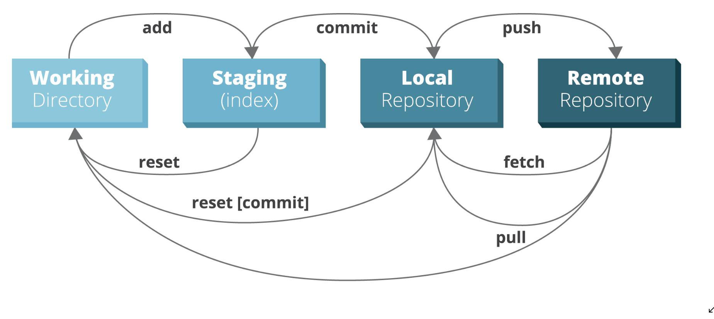
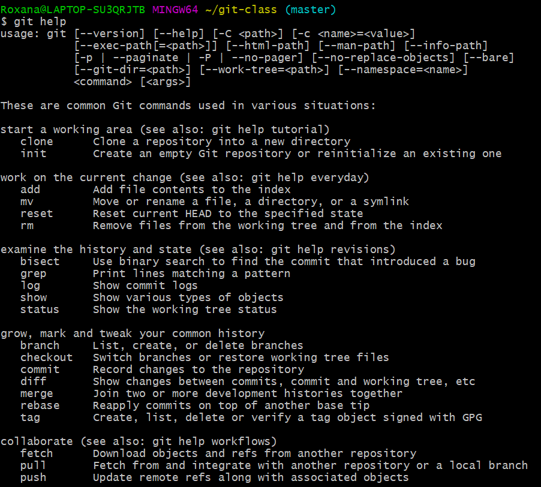

class: center, middle
# ¿Qué es Git?


---


# Git

- Git es un sistema de control de versiones creado por *Linus Torvalds*.
- Un sistema de control de versiones es una porción de software diseñada para tener seguimiento
de los cambios a lo largo del tiempo. 
- Git es un sistema de control de versiones *distribuido*, que significa que cada uno que trabaja con Git tiene una copia de la historia completa del proyecto. 

### Ventajas de usar Git
- La habilidad para deshacer cambios.
- Una historia completa de todos los cambios.
- Documentación de por que los cambios fueron hechos. 
- La tranquilidad de cambiar cualquier cosa. 
- Muchas lineas históricas. 
#### Si trabajamos en equipo
- La habilidad para resolver conflictos. 
- Creación de ramas para trabajar de manera independiente. 


---


# GitHub

- GitHub es un sitio web donde puedes subir una copia de tu repositorio de GitHub. Te permite colaborar más facilmente con otras personas en el proyecto. Lo hace proveyendo una ubicación centralizada para compartir el repositorio, una interfaz basada en la web, y caraceterísticas especiales como _fork, pull requests, issues, y wikis_.

--
### Ventajas de GitHub
- Colaborar en diferentes ramas de trabajo. 
- Re-ver el trabajo en progreso. 
- Ver el progreso del equipo. 

---


# Conceptos Clave
- __Commit__: cada vez que se guarda un cambio en cualquier archivo, se crea un commit. Cada vez
que se realiza un commit se agrega un mensaje describiendo el cambio realizado. 
- __Branch(rama)__: una serie de commits que se crean para agregar una nueva funcionalidad. 
- __Master branch (rama master)__: cuando creamos un repositorio, es la rama creada por defecto. Es la rama en donde terminarán todos los cambios realizados cuando pasen a producción (etapa final).
- __Topic master(rama propia)__: cuando estamos creando nuevas funcionalidades en una rama, las hacemos en una rama que hemos creado. Luego esos cambios serán o no aceptados para ser parte de la rama master. 
- __Merge__: es una manera de tomar los cambios realizados de una rama e incorporarlos a otra. 
- __Pull request__: se realiza para que alguien más vea los cambios realizados en una rama propia e incluirla en la rama master. 
- __Clone (clonar)__: cuando copiamos un repositorio de internet en nuestra computadora para realizar cambios allí. 
- __Fork__: cuando se crea una copia de un repositorio ajeno en nuestro perfil de GitHub. 

---


# Vamos a instalar Git 

https://rogerdudler.github.io/git-guide/index.es.html


---


# Configurar Git

- Configurar Git en nuestra computadora (entorno local)

```{r message=FALSE, warning=FALSE, eval=FALSE}
1. git config --global user.name "Roxana" #<<
2. git config --global user.email noelia0618@gmail.com #<<
```


---


# Cómo proceder con Git
### Si tenemos un repositorio en Github
- Con este comando se clona la carpeta de Github en nuestra computadora. 

```{r message=FALSE, warning=FALSE, eval=FALSE}
git clone [url] #<<
```


---


# Cómo proceder con Git
### Si nuestro repositorio está en una carpeta local y queremos subirlo a Github

```{r message=FALSE, warning=FALSE, eval=FALSE}
1. git remote add origin https://github.com/usuario/nombre_repositorio.git #<<
2. git push -u origin master #<<
```

---


# Cómo crear una rama 

```{r message=FALSE, warning=FALSE, eval=FALSE}
git branch new_name #<<
```

- Con este comando listamos las ramas creadas en ese repositorio
```{r message=FALSE, warning=FALSE, eval=FALSE}
git branch #<<
```

- Borrar la rama creada
```{r message=FALSE, warning=FALSE, eval=FALSE}
git branch -d new_name #<<
```

- Crear una rama e ir a esa rama inmediatamente
```{r message=FALSE, warning=FALSE, eval=FALSE}
git checkout -b new_name #<<
```

- Una rama no está disponible _para los demás_ a menos que la subas al repositorio remoto. 
```{r message=FALSE, warning=FALSE, eval=FALSE}
git push origin <branch> #<<
```


---


# Como realizar cambios en Git/Github
- Los cambios se hacen por etapas



---


# Como realizar cambios en Git/Github


---


# Como guardar cambios (1)

* En primer lugar se realizan los cambios en un archivo. 
* En la consola de git vamos a la carpeta de trabajo/rama de trabajo
```{r message=FALSE, warning=FALSE, eval=FALSE}
cd carpeta_trabajo
git status #<<
```
_git status_ nos permite conocer los cambios realizados.

* Esos cambios se registran mediante el comando
```{r message=FALSE, warning=FALSE, eval=FALSE}
git add file.ext #<<
```
Se agrega el archivo con la extensión.

---


# Como guardar cambios (2)

* Se realiza un commit 
```{r message=FALSE, warning=FALSE, eval=FALSE}
git commit -m "nuevo cambio" #<<
```
Se agrega un mensaje entre comillas describiendo los cambios realizados

### Ya en este punto terminan los cambios locales

---


# Como guardar cambios (3)
### Los cambios ahora se guardan en un repositorio remoto

```{r message=FALSE, warning=FALSE, eval=FALSE}
git push origin master #<<
```
Con este comando se suben los cambios realizados en un repositorio local a un repositorio remoto. 
_Pushing_ es como se transfieren commits desde el repositorio local a un repositorio remoto. 

---


# Como trabajar con repositorios remotos


---


# Git Diff
- Nos ayuda a ver las diferencias en los archivos que todavía no han sido agregados a la etapa "stage". 

```{r message=FALSE, warning=FALSE, eval=FALSE}
git diff #<<
```


---


# Fork
Fork es para copiar un repositorio remoto ajeno a nuestra lista de repositorios remotos. 
Se realiza desde Github siempre, ya que se están trabajando con repositorios remotos. 

---


# Borrar un archivo

```{r message=FALSE, warning=FALSE, eval=FALSE}
git rm archivo.ext #<<
```

---


# Para ver los commits realizados 

```{r message=FALSE, warning=FALSE, eval=FALSE}
git log #<<
```

---


# Git Tips

__1. Hacer commits a menudo__
Esto permite ahorrar conflictos con las demás personas que trabajan en el proyecto. 

__2. Testear, luego hacer el commit__
Nunca hacer commit de trabajo incompleto. Siempre testear los cambios antes de compartirlos con los demás. 

__3. Poner mensajes en el commit__
Escribir mensajes permite que los demás sepan los cambios q se han realizado. Se recomienda ser lo más descriptivo posible.

__4. Crear ramas__
Crear ramas permite crear líneas de desarrollo, para probar cambios y experimentar ahí. 

__5. Adoptar un flujo de trabajo común en Git__
Hay muchas formas de crear un apropiado flujo de trabajo. Debemos asegurarnos que todos los miembros del equipo sigan el mismo flujo de trabajo desde el principio. 


---


# Ayuda
```{r message=FALSE, warning=FALSE, eval=FALSE}
git help #<<
```




---


# Ayuda de un comando específico

```{r message=FALSE, warning=FALSE, eval=FALSE}
git help clone #<<
```

Nos abre un archivo html en el navegador de la ayuda de Git. 

---


# Qué nos permite hacer git

### - Saber la historia de un proyecto

### - Volver en el tiempo para ver cambios

### - Experimentar con los cambios

### - Hacer un backup de nuestro trabajo

### - Colaborar con otros proyectos

---


# Conceptos de Git que hemos visto

### **Repositorio**: la carpeta de tu proyecto.
### **Commit**: una captura del repositorio
### **Hash**: un id para un commit
### **Branch(rama)**
### **Merge(unión)**: nos permite unir un cambio a la rama master
### **Remote(remoto)**: una computadora con un repositorio
### **Clone(clonar)**: obtener un repositorio remoto por primera vez. 
### **Push**: mandar cambios (commits) a un repositorio remoto desde local.
- **Pull**: bajar los cambios (commits) de un repositorio remoto a local. 
---


# Bibliografía 

### git la guía sencilla [español]
https://rogerdudler.github.io/git-guide/index.es.html

### git comandos más útiles [inglés]
https://www.keycdn.com/blog/git-cheat-sheet

### Comandos básicos [inglés]
https://confluence.atlassian.com/bitbucketserver/basic-git-commands-776639767.html

### Mas links (README de este repo)
https://github.com/data-datum/git-class 

---

```{r message=FALSE, warning=FALSE}
devtools::session_info()
```

